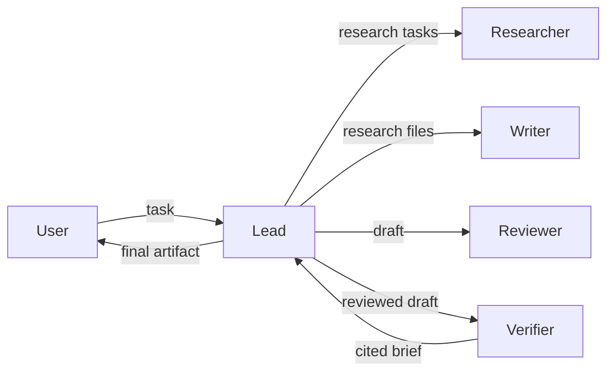

Feynman uses a multi-agent architecture for research workflows. A lead agent plans, delegates, synthesizes, and delivers. Four bundled subagents — Researcher, Writer, Reviewer, and Verifier — each handle a distinct phase of the research process.

## How orchestration works

The lead agent is responsible for breaking down a research task, deciding which subagents to invoke, and synthesizing their outputs into a final deliverable. Subagents communicate with the lead agent through file-based handoffs: each subagent writes its output to disk and passes a lightweight reference back. The lead agent reads those files rather than consuming full content in its context window.

This design keeps context pressure low during long workflows and makes intermediate outputs auditable after the fact.



## The four subagents

<CardGroup cols={2}>
  <Card title="Researcher" icon="magnifying-glass" href="/agents/researcher">
    Gathers primary evidence across papers, web sources, repositories, and documentation. Produces structured research files with an evidence table, inline-referenced findings, and a numbered Sources section.
  </Card>
  <Card title="Writer" icon="pen-nib" href="/agents/writer">
    Turns research notes into clear, structured drafts. Works only from supplied evidence — no inline citations or Sources section, which the Verifier adds in a later pass.
  </Card>
  <Card title="Reviewer" icon="circle-check" href="/agents/reviewer">
    Simulates skeptical peer review with severity-graded feedback: FATAL issues that must be fixed, MAJOR issues to surface in Open Questions, and MINOR issues that are accepted.
  </Card>
  <Card title="Verifier" icon="shield-check" href="/agents/verifier">
    Anchors every factual claim to a source, verifies each URL is live, and builds the final numbered Sources section. Does not rewrite prose — only adds citations and removes unsourced claims.
  </Card>
</CardGroup>

## Delegation rules

The lead agent follows these rules when working with subagents:

- **Decompose meaningfully.** Subagents are for work that benefits from decomposition. They are not spawned for trivial tasks.
- **File-based handoffs.** Intermediate results are written to disk by subagents and read by the lead. They are not returned inline unless you explicitly ask.
- **No silent skipping.** Subagents must mark every assigned task as `done`, `blocked`, or `needs follow-up`. Skipped or merged tasks are recorded in the plan artifact.
- **Adversarial verification.** For critical claims, at least one adversarial verification pass runs after synthesis. Fatal issues are fixed before delivery or surfaced explicitly.

## Automatic dispatch vs. manual invocation

Subagents are dispatched automatically by the lead agent during workflows like `/deepresearch`, `/lit`, `/review`, and `/draft`. You do not need to invoke them directly for standard workflows.

You can also run a subagent manually for a specific task using `/run`:

```
/run researcher find recent papers on mixture-of-experts scaling
/run writer draft the methods section from outputs/moe-research-papers.md
/run reviewer check the draft at outputs/.drafts/moe-draft.md
/run verifier add citations to outputs/.drafts/moe-draft.md
```

<Note>
  Manual invocation is useful when you want to re-run a single phase without re-running the entire workflow, or when you are iterating on a specific section.
</Note>

## File naming and output locations

Every workflow derives a short **slug** from the topic (lowercase, hyphens, no filler words, five words or fewer). All files in a single run share that slug as a prefix to prevent collisions across concurrent runs.

| Artifact | Path |
|---|---|
| Plan | `outputs/.plans/<slug>.md` |
| Research | `<slug>-research-web.md`, `<slug>-research-papers.md` |
| Draft | `outputs/.drafts/<slug>-draft.md` |
| Cited brief | `<slug>-brief.md` |
| Verification | `<slug>-verification.md` |
| Final output | `outputs/<slug>.md` or `papers/<slug>.md` |
| Provenance | `<slug>.provenance.md` |

<Warning>
  Never use generic names like `research.md`, `draft.md`, or `brief.md`. Concurrent runs must not collide.
</Warning>

## Workspace changelog

For long-running or resumable workflows, Feynman maintains a lab notebook at `CHANGELOG.md` in the workspace root. The lead agent reads this file before resuming substantial work and appends entries after meaningful progress, failed approaches, verification results, or new blockers.

Each entry identifies the active slug and ends with the recommended next step. Verification state is marked honestly: `verified`, `unverified`, `blocked`, or `inferred`.
